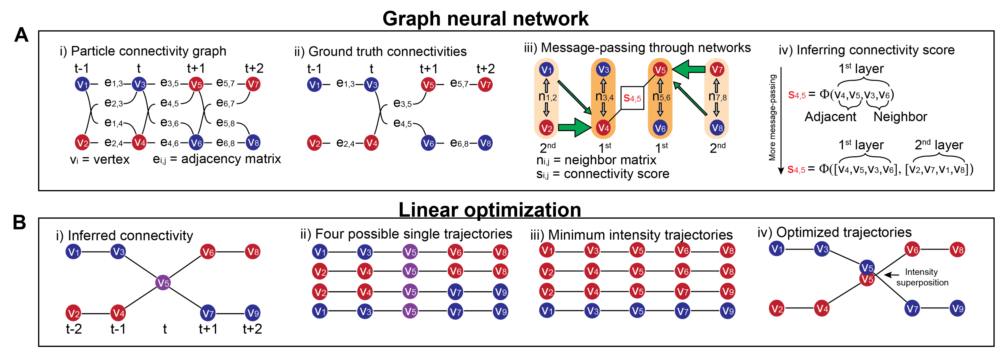

# High Throughput Tracking of Nanoparticle-Cell Interactions Using Combinatorial Multicolor Labeling and Graph Neural Networks

<p align="center">
  
</p> 

<div align="center">


</div>

---

## Abstract

This project presents a novel methodology for tracking nanoparticle-cell interactions, a critical process in biology and medicine. We employ a combinatorial multicolor labeling strategy, which allows for the identification of a large number of nanoparticles. The tracking of these nanoparticles is then performed using a Graph Neural Network (GNN), which can effectively learn the complex dynamics of nanoparticle movement and interaction. This approach enables high-throughput analysis of nanoparticle-cell interactions, providing a powerful tool for scientific research in areas such as drug delivery and nanotoxicity.

---

##  Method overview

<p align="center">

</p>
This repository provides Python codes for tracking simulated combinatorial multicolor nanoparticles using graph neural network (GNN) and linear optimization process. The GNN is used to predict the edge connectivity between particle detections in consecutive frames, and a linear optimization step is used to reconstruct the trajectories. Detailed explanations of the model architecture and optimization constraints can be found in the Supplementary Information of the publication.

---

##  Paper

This repository is for combinatoric multicolor tracking using GNN approach introduced in the following paper:

[Dongyoon Kim et al. "High Throughput Tracking of Nanoparticle-Cell Interactions Using Combinatorial Multicolor Labeling and Graph Neural Networks."]


---
### Dependencies

This project requires Python 3.12+ and the following libraries:

** Deep Learning:**
- PyTorch (2.9.1+cu130)
- PyTorch Geometric (2.7.0)

**Scientific Computing:**
- NumPy (2.4.0)
- SciPy (1.16.3)
- Pandas (2.3.3)
- Scikit-image (0.25.2)
- CVXPY (1.7.5)
- OpenCV (4.10.1)
- NetworkX (3.6.1)

**Visualization:**
- Matplotlib (3.10.8)


### Installation

```bash
# Create a new conda environment
conda create -n your_env_name python=3.12
 
# Activate the environment
conda activate your_env_name

# Install the required packages
pip install -r requirements.txt
```

### Training
The training process is detailed in the `Training.ipynb` notebook. To train the model, you can run the cells in the notebook. 

### Inference
The inference process is detailed in the `Inference.ipynb` notebook. To run inference, you can run the cells in the notebook. 

### Trained weights
The pre-trained models are available in the `model_weights` directory. The models are named according to the number of colors used for training (e.g., `3color.pt`).

